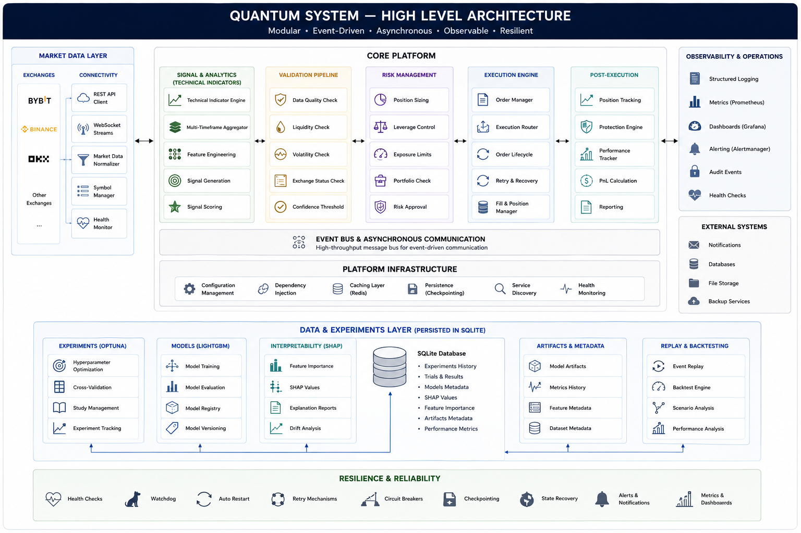

# Quantum System Showcase

> **Production-grade event-driven fintech architecture demonstrating scalable trading infrastructure, reliability engineering, and observability.**

---

## Overview

Quantum System Showcase is a public engineering portfolio derived from a large-scale production algorithmic trading platform.

This repository intentionally focuses on **software architecture, distributed systems, observability, resilience engineering, and technical product design** rather than proprietary trading strategies.

The goal is to demonstrate how a modern fintech system can be designed for continuous operation, fault tolerance, operational visibility, and long-term maintainability.

---

## What This Repository Demonstrates

* Production-grade Python architecture
* Event-driven system design
* Asynchronous service orchestration
* FastAPI backend architecture
* Real-time market data processing
* Dynamic discovery instead of static configuration
* Portfolio-level risk architecture
* Fault-tolerant execution pipelines
* Circuit breakers and graceful degradation
* Runtime configuration hot reload
* Structured telemetry
* Prometheus metrics
* Grafana monitoring
* Deployment automation
* Self-healing infrastructure
* Engineering decision making
* Technical product ownership

---

# Architecture


```
                    Exchange APIs
                 REST + WebSocket
                        │
                        ▼
             ┌────────────────────┐
             │ Market Data Layer  │
             └─────────┬──────────┘
                       │
                       ▼
            Event Processing Pipeline
                       │
          ┌────────────┴────────────┐
          │                         │
          ▼                         ▼
 Signal Generation        Market Analytics
          │
          ▼
  Validation Pipeline
          │
          ▼
   Risk Management
          │
          ▼
  Execution Engine
          │
          ▼
 Position Protection
          │
          ▼
Telemetry • Metrics • Logging
          │
          ▼
Monitoring & Recovery
```

The architecture is intentionally modular.

Every subsystem owns a single responsibility while communicating through well-defined interfaces, making the system easier to evolve, test, and operate.

---

# Engineering Highlights

## Event-Driven Architecture

Instead of tightly coupling services together, the system processes market events through asynchronous pipelines.

Benefits:

* low latency
* isolation between components
* scalability
* easier testing
* fault containment

---

## Dynamic Infrastructure

No production symbol lists are hardcoded.

The platform dynamically discovers market instruments, evaluates them, ranks them, and adapts automatically to changing market conditions.

This reduces operational maintenance while increasing adaptability.

---

## Reliability First

The platform was designed under the assumption that failures are inevitable.

Examples include:

* automatic recovery
* watchdog processes
* health checks
* circuit breakers
* retry policies
* checkpoint persistence
* graceful degradation

Instead of trying to prevent every failure, the system focuses on recovering automatically whenever possible.

---

## Observability

Every important system event becomes structured telemetry.

The architecture emphasizes:

* structured logs
* metrics
* event attribution
* latency measurement
* service health
* operational dashboards

This dramatically simplifies debugging and production support.

---

## Runtime Configuration

Configuration changes can be applied without restarting services.

Supported features include:

* risk parameters
* strategy settings
* monitoring thresholds
* feature flags
* operational controls

This minimizes downtime during production operations.

---

## Operational Excellence

The project includes engineering practices commonly found in production fintech environments:

* automated deployment
* continuous monitoring
* state persistence
* health endpoints
* alerting
* telemetry
* operational playbooks
* service recovery

---

# Repository Structure

```
quant-system-showcase/

README.md

docs/
    architecture.md
    engineering-philosophy.md
    telemetry.md
    deployment.md
    monitoring.md
    roadmap.md

examples/
    execution_flow.py
    telemetry_example.py

images/
    architecture.png
    deployment.png
    telemetry.png
    grafana-dashboard.png

LICENSE
```

---

# Documentation

| Document                  | Description                                      |
| ------------------------- | ------------------------------------------------ |
| architecture.md           | System architecture and component interactions   |
| engineering-philosophy.md | Design principles and engineering decisions      |
| telemetry.md              | Observability and instrumentation strategy       |
| deployment.md             | Production deployment architecture               |
| monitoring.md             | Monitoring, alerting, and reliability            |
| roadmap.md                | Product evolution and future technical direction |

---

# Technology Stack

### Backend

* Python
* FastAPI
* AsyncIO
* Pydantic

### Infrastructure

* Redis
* Prometheus
* Grafana
* systemd
* Linux

### Architecture

* Event-driven services
* Dependency Injection
* Service Registry
* Circuit Breakers
* Recovery Coordinator
* Hot Reload Configuration
* Structured Logging

---

# Engineering Principles

This project follows several core principles:

* Reliability over cleverness
* Automation over manual operations
* Observability by default
* Configuration over hardcoding
* Modular services over monoliths
* Continuous recovery over manual intervention
* Operational simplicity over unnecessary complexity

---

# Intended Audience

This repository is intended for:

* Engineering Managers
* Staff Engineers
* Principal Engineers
* CTOs
* Fintech companies
* DeFi startups
* Infrastructure teams
* Platform engineering organizations

---

# About

This repository intentionally excludes proprietary trading strategies, alpha generation models, and production configuration.

Instead, it focuses on demonstrating the engineering practices required to build and operate resilient, production-grade financial systems at scale.

The objective is to showcase technical leadership, software architecture, operational maturity, and product thinking rather than trading logic.
